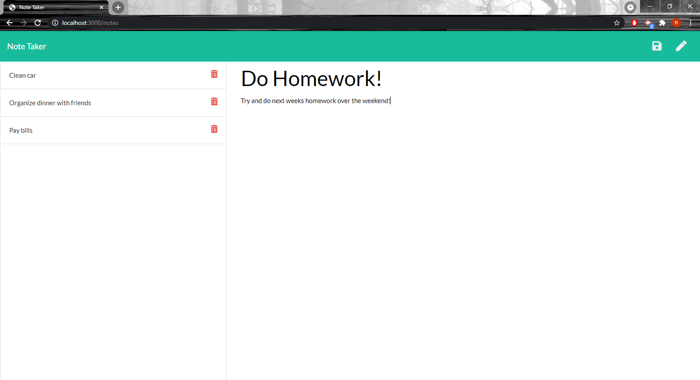

 # Note Taker
## Description
In this project I was tasked to build the back-end of a note taking application that allows users to keep track of and organize any jobs or tasks they may have. This application uses express to respond to get, post and delete requests which help to create a smooth and functional app.
## Links

Here is the deployed application at [Heroku](https://bobbies-note-taker.herokuapp.com/)

## Screenshots

## Questions
 If you have any questions please visit my GitHub at https://github.com/robert-rousset or email me at robertrousset94@gmail.com.

 ## License
This project is licensed under the MIT license.